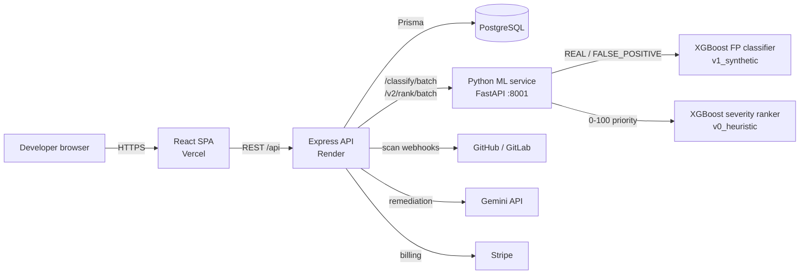
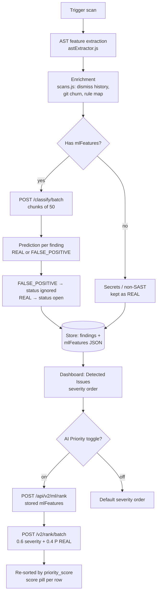

# SecureGuard


SecureGuard is a multi-tenant application for repository security scanning, vulnerability management, compliance reporting, SBOM generation, AI remediation, and billing.

This directory is the canonical application root. The Git repository root contains only the entry-point README and this app directory.

## Architecture

- `src/`: React/Vite frontend
- `backend/`: Express API, Prisma/PostgreSQL access, scanners, integrations, and tests
- `backend/prisma/`: Prisma schema and migration configuration
- `backend/services/fp-classifier/`: optional Python false-positive classifier (FastAPI, XGBoost)
- `backend/services/severity-ranker/`: optional Python severity-priority ranker, served by the same FastAPI service under `/v2/rank`
- `backend/routes/ml.js`: versioned Node proxy (`/api/v2/ml/rank`) for the ranker
- `public/`: frontend assets
- `docs/`: readiness and operational documentation

The frontend and backend are deployed separately. Vercel hosts the static SPA; the Express API is intended for a long-running Node web service such as Render. PostgreSQL and all third-party credentials remain external managed services.

## System architecture


```mermaid
flowchart LR
    Dev[Developer browser] -->|HTTPS| SPA[React SPA<br/>Vercel]
    SPA -->|REST /api| API[Express API<br/>Render]
    API -->|Prisma| DB[(PostgreSQL)]
    API -->|/classify/batch<br/>/v2/rank/batch| ML[Python ML service<br/>FastAPI :8001]
    ML -->|REAL / FALSE_POSITIVE| FP[XGBoost FP classifier<br/>v1_synthetic]
    ML -->|0-100 priority| SR[XGBoost severity ranker<br/>v0_heuristic]
    API -->|scan webhooks| GH[GitHub / GitLab]
    API -->|remediation| GEM[Gemini API]
    API -->|billing| ST[Stripe]
```

## Scan data flow


```mermaid
flowchart TD
    A[Trigger scan] --> B[AST feature extraction<br/>astExtractor.js]
    B --> C[Enrichment<br/>scans.js: dismiss history,<br/>git churn, rule map]
    C --> D{Has mlFeatures?}
    D -->|yes| E[POST /classify/batch<br/>chunks of 50]
    E --> F[Prediction per finding<br/>REAL or FALSE_POSITIVE]
    F --> G[FALSE_POSITIVE → status ignored<br/>REAL → status open]
    D -->|no| H[Secrets / non-SAST<br/>kept as REAL]
    G --> I[(Store: findings +<br/>mlFeatures JSON)]
    H --> I
    I --> J[Dashboard: Detected Issues<br/>severity order]
    J --> K{AI Priority toggle?}
    K -->|on| L[POST /api/v2/ml/rank<br/>stored mlFeatures]
    L --> M[POST /v2/rank/batch<br/>0.6 severity + 0.4 P REAL]
    M --> N[Re-sorted by priority_score<br/>score pill per row]
    K -->|off| O[Default severity order]
```

## Scan queue & cache

Scans run on a worker, not in the request. `POST /api/scans/trigger`
creates a `queued` scan and returns **202**; a BullMQ worker
(`secureguard-scans`, concurrency `SCAN_WORKER_CONCURRENCY`, default 2)
runs it in a pooled worker thread, then the scan row goes
`queued → running → completed | failed`. With no `REDIS_URL` set the
same FIFO runs in-process and the cache is bypassed — the server boots
either way. Vulnerability lists and terminal scan results are cached in
Redis (60–300 s TTLs, org-scoped, `X-Cache` headers); non-terminal
scans are never cached. See
`docs/SCAN_QUEUE_CACHE_LOADTEST.md` for the design and the measured
numbers: 100 concurrent submissions, submit p95 **6,142 ms → 716 ms**,
cache hit rate **0.95**, 101/101 scans completed, 0 failed. Production
needs `REDIS_URL` set in the Render dashboard (Render Key Value or
Upstash) or it stays on the in-process fallback.

## Requirements

- Node.js 20 or newer
- PostgreSQL compatible with the Prisma schema
- Python 3.11 or newer only when using the classifier service
- Provider credentials only for integrations enabled in production

## Local setup

```powershell
npm install
npm install --prefix backend
Copy-Item backend/.env.example backend/.env
npx prisma generate --schema backend/prisma/schema.prisma
```

Fill `backend/.env` with local values. Never commit `.env` files or copy production secrets into the repository.

For the frontend, copy `.env.example` to `.env.local` and set `VITE_API_URL` to the backend origin. Vite exposes only variables prefixed with `VITE_` to browser code; never place secrets in frontend environment files.

Start the services in separate terminals:

```powershell
npm run dev
npm run dev --prefix backend
```

The Vite frontend uses port `5173`; the API uses port `5000`. `GET http://localhost:5000/health` returns a non-sensitive readiness response.

## Frontend deployment: Vercel

Use `SecureGaurd-main/` as the Vercel project root and deploy with the included `vercel.json`.

Set this Vercel environment variable after the backend has a public URL:

```text
VITE_API_URL=https://<backend-host>
```

Then create a production build:

```powershell
npm run lint
npm run build
npx vercel --prod --yes --name secureguard-main
```

## Backend deployment: Render

The included `render.yaml` defines a Node web service with:

- Root directory: `SecureGaurd-main/backend`
- Build command: `npm install && npm run build`
- Start command: `npm start`
- Health check: `/health`

Create the service from the repository Blueprint, then set every `sync: false` variable in the Render dashboard. At minimum, configure `DATABASE_URL`, `JWT_SECRET`, `JWT_REFRESH_SECRET`, `ENCRYPTION_KEY`, `WEBHOOK_SECRET`, and `FRONTEND_URL` with the exact Vercel production URL. Never put these values in GitHub, `render.yaml`, or README files.

After the backend is live, set `VITE_API_URL` in Vercel and redeploy the frontend. Confirm the backend health endpoint and a browser login flow before inviting real users.

## Verification

```powershell
npm run lint
npm run build
node --test backend/tests/*.test.js
npm audit --omit=dev
```

Run database integration and end-to-end scripts only with a disposable test database and test credentials. Never execute Terraform, Kubernetes, Docker, package installation, or repository scripts from scanned repositories.

## E2E fix batch — 19 Nov 2026

An end-to-end test run (report: `~/workspace/user/files/secureguard-e2e-report-2026-11-19.md`, kept out of the repo) found the app was not genuinely working end to end. The fixes in this batch, all local and unpushed until approved:

- **No more phantom repos.** The dashboard auto-created a repo from the user's first name (`harsh/secureguard-main`, a GitHub 404) whenever the repo list was briefly empty. That effect is deleted. Connect now verifies reachability with `git ls-remote` before storing a URL, and connect failures always surface a toast instead of failing silently.
- **Honest scan states.** A FAILED scan with 0 findings was labelled "Clean Scan"; it now shows "Scan failed" with the failure reason, stored on the scan row (`Scan.errorMessage`, migration `20261119_scan_error_vuln_indexes`). Scan rows are clickable and open a new `/scans/:id` detail page. Trigger Scan asks for confirmation, takes the repo explicitly (no more stale-selection scans), and the trigger/poll fetches time out so the button can never stick on "Scanning…".
- **One definition of "how many findings".** Dashboard, Vuln DB, chart and compliance disagreed because each counted a different slice. Canonical: open findings, distinct by (rule, file, line). `GET /api/vulnerabilities` defaults to `status=open`, returns severity-ranked rows with `?page&limit` and `X-Total-Count`. Re-scans no longer insert duplicate rows (`utils/findingDedup.js`, used by the queued and webhook scan paths). The chart renders real per-day counts instead of hardcoded bars; per-scan counters are labelled "at scan time". Compliance counts `ignored` as resolved instead of dropping it from both sides.
- **SBOM page** falls back to the org-wide list when the per-repo lookup 404s, and shows a real error instead of "No SBOM" when the server fails.
- **AI fix honesty.** The detail page rendered the real engine from `GET /api/ai/status` (rule-based when no Gemini key is set) instead of a hardcoded "Gemini 1.5 Flash" label, and the fix engine's template score is shown separately labelled — never as the finding's CVSS.
- **Billing honesty.** An expired subscription period no longer counts as a paid plan; the billing modal says "Billing not configured" when Razorpay keys/plans are missing (vars documented in `backend/.env.example`). The live Pro row from the old mock checkout still needs an owner decision (downgrade to Free or grandfather it).
- **Analytics scope.** The product-activity panel is labelled site-wide (all accounts), restricted to OWNER/ADMIN, and probe/404 paths no longer top "most visited pages".
- **Smaller fixes.** Finding IDs are one format (`V-0068`) everywhere; the Vuln DB has a status filter, AI-priority sort and 25/page pagination; the active tab survives refresh (`?tab=`); the header wraps at ~1034px instead of clipping buttons; `/verify-email` and `/oauth/callback` have correct page titles and the email link auto-verifies on landing; the CI/CD template uses the real webhook URL; Settings can edit the profile name (`PATCH /api/auth/me`) and replay onboarding (`/onboarding?replay=1`).

Regression tests: `backend/tests/e2eFixes.test.js` (10 tests — dedup, compliance ignored bucket, billing expiry, analytics topPaths filter, vuln-list definition, advisory-lock `$executeRaw` regression). Full suite: 107/109 pass; the 2 failures are the pre-existing live-Postgres/secrets ones (`compliance`, `deployment_config`).

**Connect 500 — root cause found in Render logs, fixed here.** Every repo-connect attempt in the E2E window failed with Prisma P2010: `pg_advisory_xact_lock` returns `void`, and Prisma 7's pg adapter cannot deserialize a void column via `$queryRaw`. The lock call in `routes/repos.js` (and the same defect class in `routes/organizations.js` demote/remove/leave paths) now uses `$executeRaw`, which runs the statement without deserializing a result. Regression test above pins all four call sites.

## API keys — 19 Nov 2026

Programmatic access without a password or JWT. OWNER/ADMIN create keys in Settings → API Keys; the full key (`sg_…`) is shown once and never stored — only its sha256 hash. Scopes: `read` (GET findings, scans, SBOMs via the `X-Api-Key` header) and `scan:trigger` (POST `/api/scans/trigger`). Every other method/path with a key is a 403. Keys are org-scoped, revocable (soft revoke, kept for audit), optionally expiring, and die with the creator's org membership. Model `ApiKey` + migration `20261119_api_keys`; management routes `backend/routes/apiKeys.js`; auth in `backend/middleware/apiKeyAuth.js`; tests `backend/tests/apiKeys.test.js` (7 tests). Full suite with this feature: 107/109 pass (same 2 pre-existing env failures).

## Dashboard crash — 19 Nov 2026

After the E2E fix batch shipped, every load of `/dashboard` showed only the error boundary ("Something went wrong") on all tabs, while `/scans/:id` and `/vulnerabilities/:id` rendered fine. The browser could not open DevTools, so a temporary diagnostic build made the error boundary render the error itself: `ReferenceError: Cannot access 'pt' before initialization`. The minified bundle traced `pt` to the Vuln DB filter state — the E2E batch had added `useEffect(() => { setVulnPage(1); }, [filterSev, filterType, filterStatus, searchQuery])` ~200 lines above the `useState` lines declaring those variables. A `useEffect` dependency array is evaluated at render time, so the render read the `const` bindings while they were still in the temporal dead zone and the whole dashboard crashed. The fix deletes the effect entirely: the page reset now lives in the five filter change handlers (severity ×2, type, status, search), which also satisfies the `react-hooks/set-state-in-effect` rule the effect violated. The temporary diagnostic in `ErrorBoundary.tsx` was reverted in the same change. Regression test in `backend/tests/e2eFixes.test.js` (now 11 tests) pins that no `useEffect` dependency is declared after its effect and that all five filter controls reset the page. Full suite with this fix: 108/110 pass (same 2 pre-existing env failures).

Still owner-only (not code): delete/disconnect the `harsh/secureguard-main` repo row in production and connect the real repo; Razorpay keys + plans; Brevo verified sending domain; Google/GitHub OAuth client IDs; a backfill dedupe of the existing 112 finding rows.

## Security checklist

- Backend CORS is allowlisted through `FRONTEND_URL` and `FRONTEND_URLS`; it does not accept arbitrary origins.
- Authentication, organization context, RBAC, and tenant filters are the authorization boundary.
- Keep Stripe, GitHub/GitLab, Gemini, database, JWT, encryption, and webhook secrets server-side.
- Rotate any credential that has ever been committed or exposed.
- Review `SECURITY_AUDIT.md`, `LIMITATIONS.md`, and `docs/production-readiness-report.md` before production release.